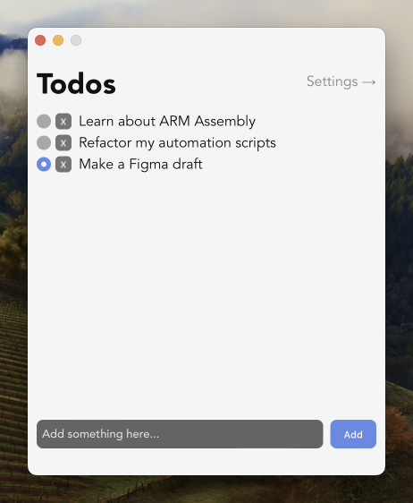
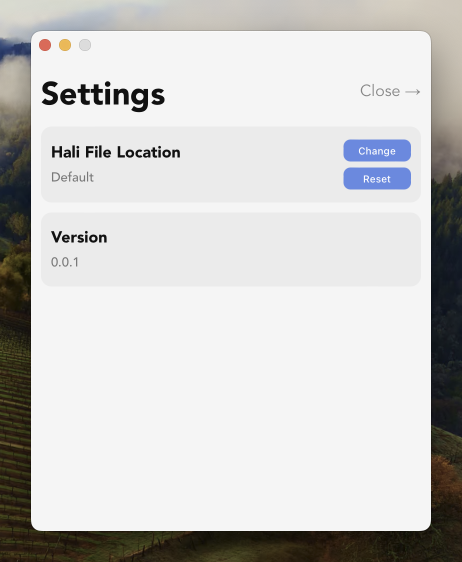

<!--  -->

# Hali
Hali is a straightforward todo app where the app data is stored in a simple text format. It also lets you set your custom file path.

<div>
    
    
</div>

```hali
- [] Learn about ARM Assembly
- [] Refactor my automation scripts
- [x] Make a Figma draft
```